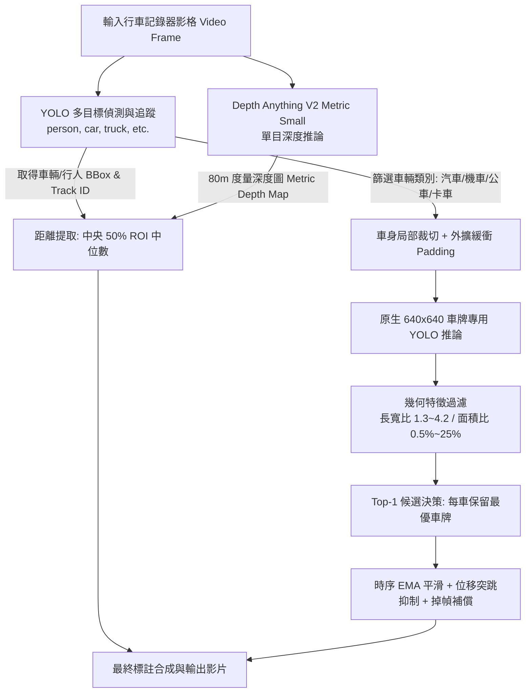

# 🚗 Edge ADAS: 行車動態目標追蹤、單目公尺測距與兩階段高精車牌辨識系統

本專案是一套專為**動態行車記錄器 (Moving Dashcam / Ego-Vehicle)** 場景設計的高效能電腦視覺感知系統。整合 **YOLO 多目標時序追蹤**、**Depth Anything V2 單目度量深度估算 (Metric Depth Estimation)** 以及**兩階段局部裁切 (Two-Stage Crop & Detect) 車牌辨識引擎**，並配備**抗抖動平滑濾波 (Anti-Jitter Temporal Smoothing)** 與**幾何特徵過濾 (Geometric Filtering)**，能在行進間精確標註周遭人車、測量前車真實公尺距離，並穩定鎖定車牌。

---

## 🌟 核心特色與技術突破



### 1. 動態自車公尺測距 (Monocular Metric Depth Estimation)
- **擺脫固定相機限制**：傳統相機標定或純光流測速在「自身行駛中 (Ego-motion)」的車輛上會徹底失效（例如前車與自車等速行駛時相對像素位移為 0）。
- **實體距離輸出**：採用在 VKITTI 數據集上訓練的 `Depth-Anything-V2-Metric-VKITTI-Small` 模型，直接推算各像素的**真實公尺距離 ($0 \sim 80\text{m}$)**。
- **中央 50% ROI 中位數採樣**：自車輛邊界框正中央 50% 範圍取深度中位數 (Median)，完全避開邊緣背景穿透（如路面、天空）造成的距離飄移。

### 2. 兩階段超解析度車牌檢測 (Two-Stage Crop & Detect)
- **解決尺度失配 (Scale Mismatch)**：車牌在 1080p 全圖中通常僅佔 $50 \times 20$ 像素；若直接用在 640 解析度訓練的模型推論 1080p/1920p 全圖，會導致近處車牌爆框失效、路邊雜物誤判。
- **大幅提升信心度**：先由目標模型鎖定車輛，再將車身加上 8% 緩衝外擴邊距 (Padding) 裁切，送入原生 640 尺度的車牌模型，使車牌平均信心度從 0.51 躍升至 **0.78+**。
- **精準節省算力**：自動過濾行人 (0) 與腳踏車 (1)，僅對汽車 (2)、機車 (3)、公車 (5)、卡車 (7) 進行裁切，徹底杜絕衣服圖案誤判。

### 3. 車牌防抖動與偽陽性過濾引擎 (Anti-Jitter & Geometric Filtering)
- **長寬比與面積過濾**：車牌寬高比限定在 $1.3 \sim 4.2$，面積佔車身 $0.5\% \sim 25\%$，徹底排除水箱護罩格柵、車廠廠徽、車燈與反光飾條。
- **單車 Top-1 決策**：每輛車僅鎖定信心度最高的一個車牌框，避免一車多框或前後保桿來回跳躍。
- **時序指數移動平均 (EMA Smoothing, $\alpha=0.65$)**：連結車輛 `track_id` 進行跨影格平滑，消除逐格 3~8 像素的微幅震顫。
- **突跳抑制 (Jump Rejection)**：若單影格內車牌橫向位移超過車寬 40%，視為誤檢噪點予以剔除。
- **掉幀平滑補償 (Holdover)**：若車輛因反光或陰影短暫遺失車牌 1~2 格，系統會跟隨車身移動向量保持車牌框，避免畫面閃爍。

---

## 📁 專案目錄結構

```text
c:\Users\User\Desktop\test\
├── Depth-Anything-V2/           # Depth Anything V2 官方開源模組庫
│   └── metric_depth/            # 度量深度估算模型代碼 (DPT)
├── checkpoints/
│   └── depth_anything_v2_metric_vkitti_vits.pth  # 95MB Small 深度模型權重
├── detect_and_annotate.py       # 系統核心主程式 (偵測、測距、追蹤、平滑、標註)
├── license-plate-finetune-v1s.pt# 專用車牌微調 YOLO 模型 (Stage 2)
├── yolo26s.pt                   # 全目標多類別 YOLO 偵測追蹤模型 (Stage 1)
├── vid.mp4                      # 輸入測試影片
└── README.md                    # 本說明文件
```

---

## 🛠️ 環境需求與安裝

### 1. 硬體建議
- **GPU**：NVIDIA 顯卡（推薦 RTX 3060 Ti / RTX 4060 或以上，需具備 $\ge 6\text{GB}$ VRAM）。
- **推論記憶體占用**：雙 YOLO 模型 + Depth Small 於 392 解析度下，總顯存占用約 **3.4 GB**。

### 2. Python 環境設定
建議使用 Python 3.10+ 環境：

```powershell
# 安裝 PyTorch (支援 CUDA)
pip install torch torchvision --index-url https://download.pytorch.org/whl/cu121

# 安裝 Ultralytics (YOLO) 與 OpenCV
pip install ultralytics opencv-python numpy
```

---

## 🚀 快速上手使用

### 1. 預設模式（全功能：YOLO 追蹤 + 公尺測距 + 兩階段車牌）
```powershell
python detect_and_annotate.py --video vid.mp4 --output annotated_output.mp4
```

### 2. 快速預覽模式（僅處理前 150 影格）
適合調參或測試影片效果，免去整段跑完的時間：
```powershell
python detect_and_annotate.py --video vid.mp4 --output preview.mp4 --max-frames 150
```

### 3. 高精度深度測距模式（提升深度圖輸入尺寸至 518）
```powershell
python detect_and_annotate.py --video vid.mp4 --depth-size 518
```

### 4. 輕量高速模式（關閉深度測距）
若在顯存有限或需追求極致 FPS 的邊緣裝置上執行：
```powershell
python detect_and_annotate.py --video vid.mp4 --no-depth
```

### 5. 測試傳統全圖車牌偵測（對比兩階段效益）
```powershell
python detect_and_annotate.py --video vid.mp4 --no-two-stage
```

---

## ⚙️ 完整命令列參數對照表 (CLI Options)

| 參數名稱 | 預設值 | 型態 | 說明與調優建議 |
| :--- | :---: | :---: | :--- |
| `--video` | `vid.mp4` | str | 輸入影片檔案路徑。 |
| `--output` | `annotated_output.mp4` | str | 輸出標註影片路徑。 |
| `--conf-vehicle` | `0.25` | float | Stage 1 目標偵測信心門檻。 |
| `--conf-plate` | `0.30` | float | Stage 2 車牌偵測門檻。兩階段模式建議設為 `0.30~0.35`，配合幾何過濾可徹底抑制假陽性。 |
| `--imgsz-vehicle` | `640` | int | 第一階段人車偵測推論尺寸。 |
| `--imgsz-plate` | `640` | int | 第二階段車牌裁切塊推論尺寸（原生 640 尺度，無形變）。 |
| `--two-stage` / `--no-two-stage` | `True` | flag | 啟用 / 關閉兩階段局部裁切車牌檢測。 |
| `--top1-per-vehicle` / `--no-top1` | `True` | flag | 每輛車僅保留最高信心度之車牌（杜絕一車多框與水箱罩跳動）。 |
| `--smooth` / `--no-smooth` | `True` | flag | 啟用 / 關閉跨影格 EMA 時序平滑濾波與掉幀補償。 |
| `--smooth-alpha` | `0.65` | float | 時序平滑權重 ($0.1 \sim 0.9$)。值愈大跟隨愈靈敏，值愈小移動愈平穩。 |
| `--crop-padding` | `0.08` | float | 車輛框裁切外擴比例 (8%)，避免緊湊邊界框裁掉貼邊車牌。 |
| `--min-vehicle-size` | `50` | int | 最小車輛像素尺寸（長或寬低於 50px 之極遠車輛不進行裁切，節省算力）。 |
| `--enable-depth` / `--no-depth` | `True` | flag | 啟用 / 關閉 Depth Anything V2 單目度量公尺測距。 |
| `--depth-ckpt` | `checkpoints/...` | str | 深度模型權重路徑。 |
| `--depth-size` | `392` | int | 深度模型解析度。可選 `266` (極速), `392` (平衡推薦), `518` (高精)。 |
| `--batch-size` | `8` | int | GPU 影片影格批次大小。 |
| `--crop-batch-size` | `16` | int | 車牌裁切區塊 GPU 推論批次大小。 |
| `--max-frames` | `0` | int | 最大處理影格數（`0` 代表處理整部影片）。 |
| `--device` | `cuda` | str | 推論硬體裝置 (`cuda` 或 `cpu`)。 |

---

## 📊 執行輸出與統計報告範例

程式執行完成後，終端機會即時印出結構化統計報表，方便評估偵測質量與調參效果：

```text
==================================================
📊 偵測與信心值統計報告 (Detection & Confidence Summary)
==================================================
總處理影格數: 270 / 270
🚗 車輛偵測總次數: 853 框
   - 平均信心值: 0.812
   - 最高信心值: 0.941
   - 最低信心值: 0.252
--------------------------------------------------
🪪 車牌偵測總次數: 264 框
   - 平均信心值: 0.785
   - 最高信心值: 0.897
   - 最低信心值: 0.304
==================================================
```

---

## 💡 常見問題與深度探討 (FAQ)

### Q1: 為什麼行車記錄器不能使用傳統固定相機的測速/測距？
> **答**：固定路口測速監視器的相機是靜止的，地面像素座標與世界座標有固定的單應性矩陣 (Homography)；但行車記錄器本身隨自車持續前進、顛簸與轉彎（具備動態自我運動 Ego-motion）。若前車與自車以相同時速等速前進，前車在畫面中的像素幾乎完全靜止。因此，本系統採用 Monocular Metric Depth Estimation (單目度量深度估算)，直接以公尺為單位推算空間絕對距離，完全不受自車速度影響。

### Q2: 車牌模型已經只訓練車牌單一類別，為什麼還需要兩階段裁切 (Two-Stage)？
> **答**：兩大主因：
> 1. **解析度與感受野 (Receptive Field)**：車牌在 1080p 畫面中通常極小（可能僅 30~50 像素寬）。若送入 $640 \times 640$ 的全圖 YOLO 模型，車牌會被壓縮成不到 15 像素，細節全失；若直接輸入 1920 解析度，離鏡頭較近的車牌在畫面中佔比過大，超出模型在 640 尺度下學習到的特徵範圍，導致嚴重漏檢。
> 2. **消除背景偽陽性**：路邊廣告看板、告示牌、建築物通風口極易被誤檢為車牌。透過第一階段「先確認是車輛，再在車身範圍內尋找車牌」，即可徹底排除非車輛區域的干擾。

### Q3: 為什麼要將 Depth Anything 的輸入尺寸設為 392 而非預設 518？
> **答**：在即時/邊緣系統中，推論速度是關鍵瓶頸。Depth Anything V2 Small 在 `input_size=392` 時單張推論僅約 **60~70ms**，相較 `518` (約 **110~130ms**) 提速近一倍，且對於車體中心大面積的深度估算中位數精度幾乎毫無衰減，是最佳的速度與精度平衡點。
